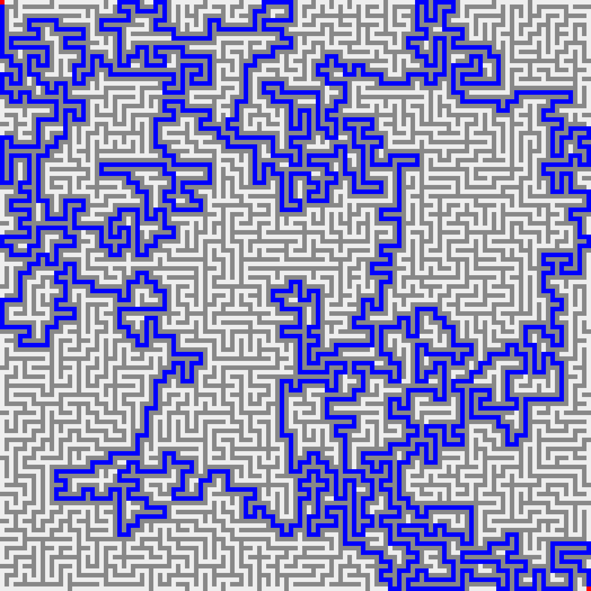
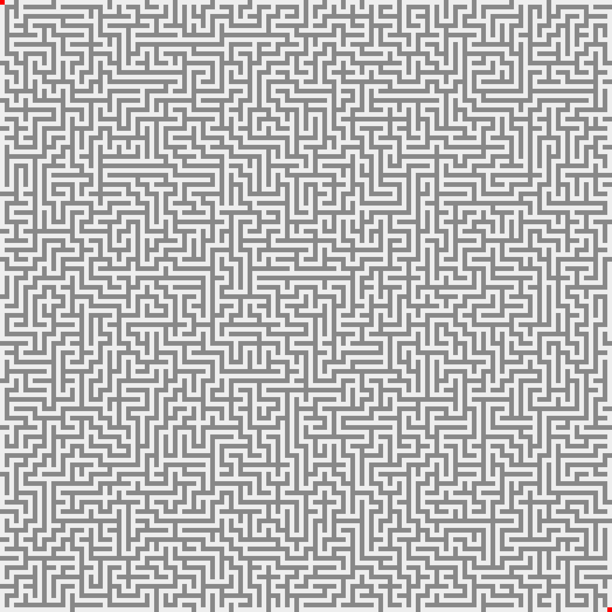

# Maze PNG generator
Maze generator that outputs perfect PNG images using libpng.

# Controlling the behavior
  All options for the maze like the colors of different elements, the mazes width and height, and the scaling of the image (how many pixels is each cell of the maze grid), are in the program.hpp file

# Running
  1) Install clang++/g++
  2) Go to the project directory
  3) run `make  run`

# Examples

